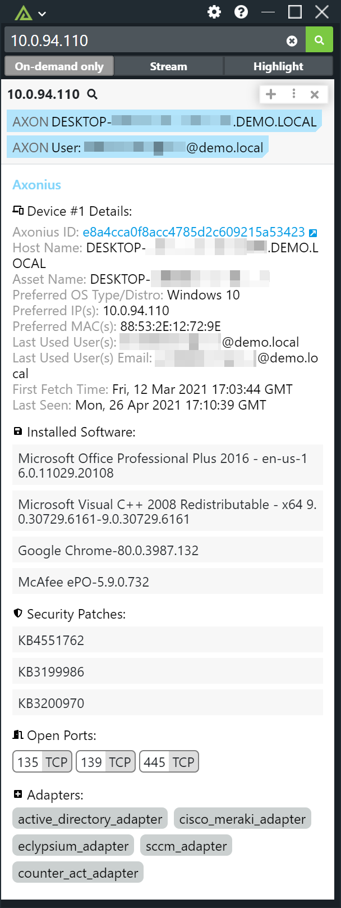
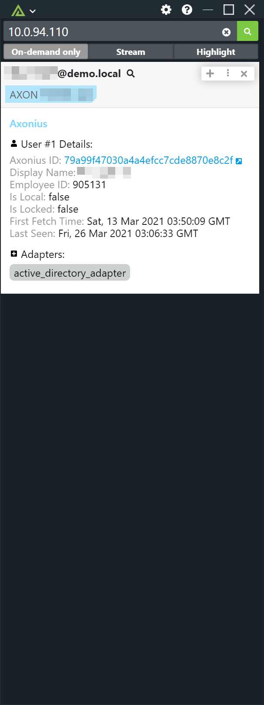

# Polarity Axonius Integration

The Polarity Axonius integration allows Polarity to search the Axonius API to return event information on internal users and assets.  The integration supports device lookups by preferred IP address, domain and a custom hostname type. In addition, user lookups are supported via e-mail address.

Note that hostname lookups search both the asset name, hostname, and preferred hostname fields.

The integration includes a custom hostname entity type that will match on strings that are between 5 and 25 characters and contain only valid hostname characters (i.e., lowercase and uppercase "a-z", digits "0-9", and a dash "-").

Custom hostname matches include partial matches on the hostname.  For example, if you search on the string `server`, then it will match hostnames that include `server` in them such as `server-01`, `server-02`, `server-03`, etc.

|  |  |
|---|---|
|*Lookup Device by IP* | *Lookup User by Email* |

To learn more about Axonius please see their official website at [https://www.axonius.com/](https://www.axonius.com/)

## Axonious API Options 

### Axonius URL
The base URL for your Axonius server including the schema (i.e., https://) and port (e.g., https://myaxonius)

### Axonius API Key
Valid Axonius API key.  Available via https://myaxonius/account/api-key.

### Axonius API Secret
Valid Axonius API secret associated with the provided key.  Also available via https://myaxonius/account/api-key.

### Search Result Limit
Maximum number of Axonius search results to return in the Polarity overlay window.

### Asset Search by IP Query
The query to run when searching assets/devices by IP address. The string `{{ENTITY}}` will be replaced by the looked up IP address.

The default query is:

```
specific_data.data.network_interfaces.ips_preferred == "{{ENTITY}}"
```

### Asset Search by Host Query
The query to run when searching assets/devices by hostname. The string `{{ENTITY}}` will be replaced by the looked up email address.

The default query runs a case-insensitive exact match on name, hostname, and preferred_hostname fields: 
```
(specific_data.data.name == regex("^{{ENTITY}}$", "i")) or (specific_data.data.hostname == regex("^{{ENTITY}}$", "i")) or (specific_data.data.preferred_hostname == regex("^{{ENTITY}}$", "i"))
```

Using the regex constructor is expensive and cause queries to take a long time  (> 60 seconds) in environments with a large number of assets. The `regex` method is used to make the searches case-insensitive.  If your hostnames use a consistent naming convention it can be more performant to have users always search in the proper case.  When searching certain fields that have an equivalent `details` field (e.g., `name_details`), searching the primary `name` field also appears to search iterations in the `name_details` field.  

If possible, it is best to do exact match queries on only the fields you need to search.  As an example, to do an exact match query on just the `name` you can use the following:

```
specific_data.data.name == "{{ENTITY}}"
```

To run a non-exact match search you can use the following query:

```
(specific_data.data.name == regex("{{ENTITY}}", "i")) or (specific_data.data.hostname == regex("{{ENTITY}}", "i")) or (specific_data.data.preferred_hostname == regex("{{ENTITY}}", "i"))
```

### User Search by Email Query
The query to run when searching users by email address. The string `{{ENTITY}}` will be replaced by the looked up email address.

The default query is:

```
specific_data.data.username == "{{ENTITY}}"
```

## Installation Instructions

Installation instructions for integrations are provided on the [PolarityIO GitHub Page](https://polarityio.github.io/).

## Polarity

Polarity is a memory-augmentation platform that improves and accelerates analyst decision making.  For more information about the Polarity platform please see:

https://polarity.io/
