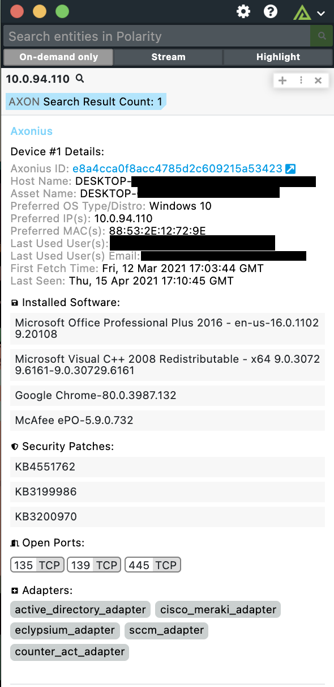

# Polarity Axonius Integration

The Polarity Axonius integration allows Polarity to search the Axonius API to return event information on internal users and assets.  The integration supports asset lookup by IP address or FQDN (domain) and user lookups via e-mail address.

To learn more about Axonius please see their official website at [https://www.axonius.com/](https://www.axonius.com/)

## Axonious API Options 

### Axonius URL
The base URL for your Axonius server including the schema (i.e., https://) and port (e.g., https://myaxonius)

### Axonius API Key
Valid Axonius API key.  Available via https://myaxonius/account/api-key.

### Axonius API Secret
Valid Axonius API secret associated with the provided key.  Also available via https://myaxonius/account/api-key.

### Search Result Limit
Maximum number of Axonius search results to return in the Polarity overlay window.

## Installation Instructions

Installation instructions for integrations are provided on the [PolarityIO GitHub Page](https://polarityio.github.io/).

## Polarity

Polarity is a memory-augmentation platform that improves and accelerates analyst decision making.  For more information about the Polarity platform please see:

https://polarity.io/
